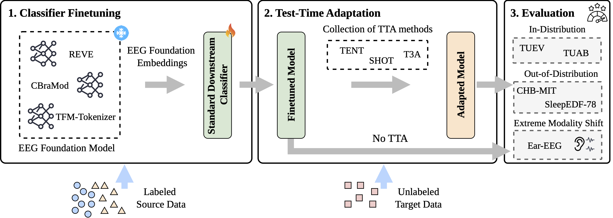

# NeuroAdapt-Bench

[](https://arxiv.org/abs/2604.16926)



NeuroAdapt-Bench is a systematic benchmark for evaluating test-time adaptation (TTA) methods for EEG foundation models under realistic distribution shifts. It covers representative TTA methods across multiple foundation models, heterogeneous datasets, clinical EEG tasks such as seizure detection and sleep staging, and deployment shifts across clinical settings, acquisition devices, and extreme modality shifts such as Ear-EEG.

This repo provides code for [Test-Time Adaptation for EEG Foundation Models: A Systematic Study under Real-World Distribution Shifts](https://arxiv.org/abs/2604.16926) (MLHC 2026, ICML SD4H 2026).

## News

* **2026-07-03**: NeuroAdapt-Bench accepted to [MLHC 2026](https://mlhc.org/)!
* **2026-05-22**: NeuroAdapt-Bench accepted to [ICML 2026 Workshop on Structured Data for Health (SD4H)](https://openreview.net/forum?id=4cg9BC5BZh)!

## Getting Started

Python 3.13 is required.

```bash
pip install -r requirements.txt
```

## Datasets

- TUEV
- TUAB
- CHB-MIT
- EAR-EEG
- Sleep-EDF-78

## EEG Foundation Models

- CBraMod
- TFM-Tokenizer
- REVE Base
- REVE Large

## Classifier Finetuning

Fine-tune a classifier head before running TTA.

Set dataset metadata, model checkpoints, and output directories in `config.py`. Use CLI flags for the experiment, encoder, dataset, seed, and batch size.

```bash
python finetune_classifier.py \
  --experiment common \
  --encoder cbramod \
  --dataset tuev \
  --seed 5 \
  --batch-size 512
```

## Test-time Adaptation Benchmarking

Run TTA after classifier fine-tuning.

Set dataset metadata, model checkpoints, and output directories in `config.py`. Use CLI flags for the experiment, model, dataset, seed, and batch size.

```bash
python run_experiment_main.py \
  --experiment common \
  --model cbramod \
  --dataset tuev \
  --seed 5 \
  --batch-size 64
```

## Cite NeuroAdapt-Bench

If you find NeuroAdapt-Bench useful, please consider citing:

```
@article{lee2026neuroadapt,
  title={Test-Time Adaptation for EEG Foundation Models: A Systematic Study under Real-World Distribution Shifts},
  author={Lee, Gabriel Jason and Pradeepkumar, Jathurshan and Sun, Jimeng},
  journal={arXiv preprint arXiv:2604.16926},
  year={2026}
}
```

Thank you for your interest in our work!
