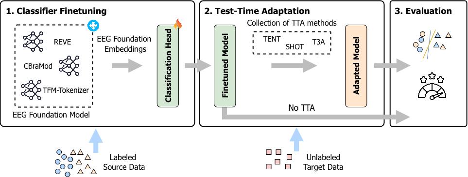

# Test-Time Adaptation for EEG Foundation Models: A Systematic Study under Real-World Distribution Shifts



## Getting Started

Python 3.13 is required.

```bash
pip install -r requirements.txt
```

## Datasets

- TUEV
- TUAB
- CHB-MIT
- EAR-EEG
- Sleep-EDF-78

## EEG Foundation Models

- CBraMod
- TFM-Tokenizer
- REVE Base
- REVE Large

## Classifier Finetuning

Configuration is defined in `config.py`, including the registered experiments, seeds, default batch sizes, dataset metadata, model checkpoints, and output directories used by the fine-tuning pipeline.

```bash
python finetune_classifier.py \
  --experiment common \
  --encoder cbramod \
  --dataset tuev \
  --seed 5 \
  --batch-size 512
```

## Test-time Adaptation Benchmarking

Configuration is defined in `config.py`, including the available experiments, models, datasets, seeds, and the output layout used by the benchmarking pipeline.

```bash
python run_experiment_main.py \
  --experiment common \
  --model cbramod \
  --dataset tuev \
  --seed 5 \
  --batch-size 64
```
